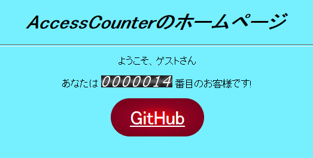

# アクセスカウンター

アクセス数を数えて画像を返すアレです。



## カウンター画像
http://navi21.jp/dron/sozai/index.html


## 自分のプロジェクトでの使い方
AccessCounter ディレクトリを適当にコピーすれば使えます。Redisバックエンド以外で永続化したい場合にはなんか適当に頑張ってください。

```csharp
public void ConfigureServices(IServiceCollection services)
{
    ...

    services
        .AddAccessCounter(options =>
        {
            options.MinDigits = 7;
        })
        
        // Redis をバックエンドにつかう場合
        .UseRedisBackend(options =>
        {
            options.ConnectionString = "localhost";
        });

        // In-Memory バックエンドを使う場合
        .UseInMemoryBackend();

    ...
}

public void Configure(IApplicationBuilder app, IHostingEnvironment env)
{
    ...

    app.Map("/counter.cgi", x => x.UseAccessCounter());
}
```